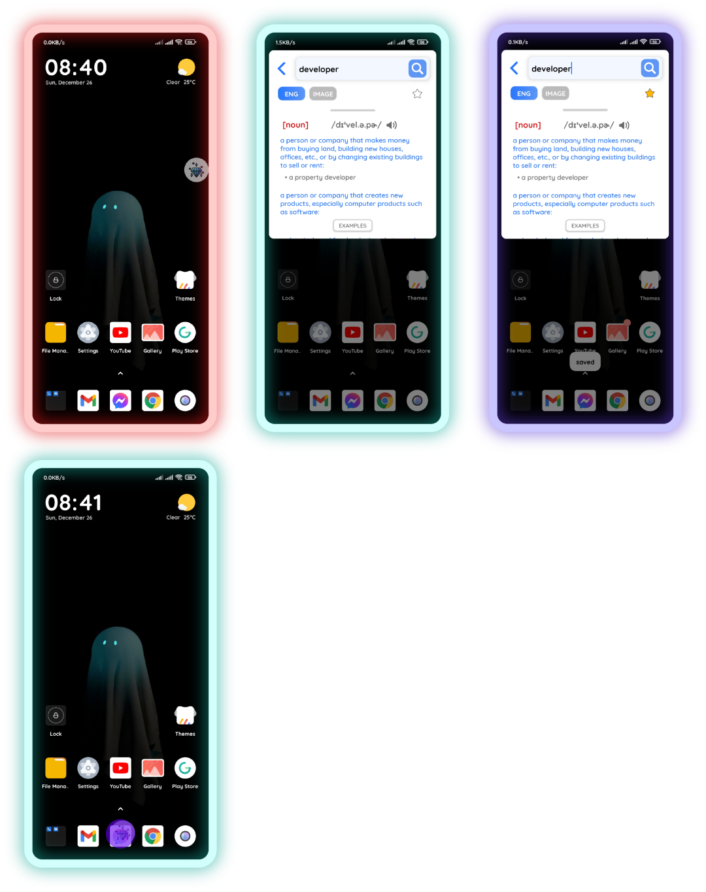
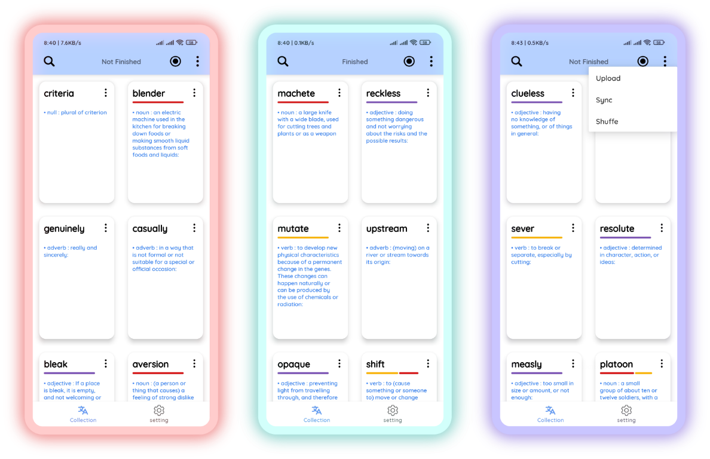
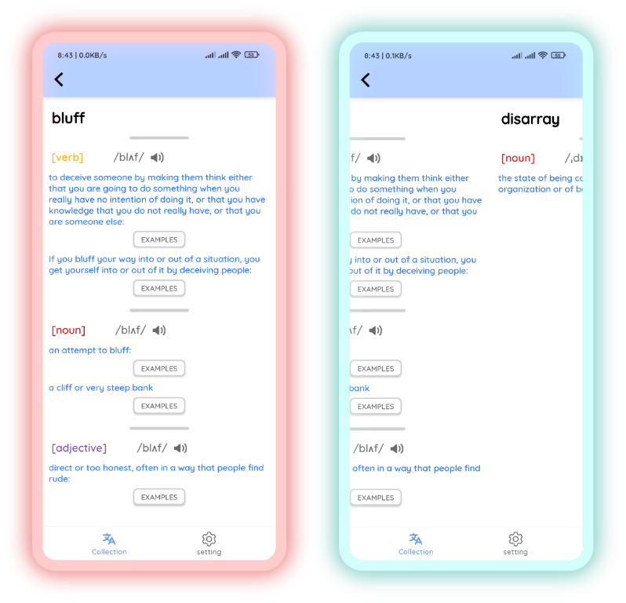

## DISCONTINUED
<b> this project is discontinued <b>

  
## Content

I. What this app is used for?
  - Quickly search for the definitions of word
  - Help you learn new vocabularies easier
  - Syncing between android devices using Google Account, so that your large collection of vocabularies won't be loss ^^

II. Technologies
  - Kotlin coroutines
  - Firebase DB, Room DB
  - Android Jetpack
  - Dagger Hilt
  - Lifecycle/Activity Components
  - Retrofit
  - Lottie
  - Jsoup
  - etc

III. Time Consuming
  - Jun - Aug 2021

IV. Demo

https://user-images.githubusercontent.com/85553681/151544511-274e40ce-8583-4e15-95f2-7c369fba8467.mp4

V. Screenshots
  
> floating bubble    

> home screen    

> vocab details    

